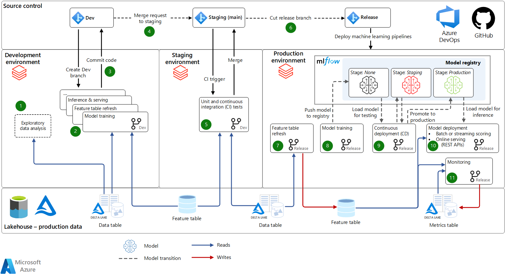

modelo_ativação_totvs
==============================

Neste repositório mostrarei como usar Azure Databricks para o desenvolvimento e treinamento de modelos de inteligência artificial disponibilizando-os em um processo de integração e entrega contínua (CI/CD).

A ideia principal é construir um projeto de ponta a ponta para desenvolvimento, treinamento, implantação e monitoramento de modelos de machine learning.

Steps: <br>
1. [DONE] Treinar um modelo de previsão de rotatividade usando Azure Databricks
2. [DONE] Implantar o modelo de aprendizado de máquina
3. [...] Construir um pipeline de MLOps
4. [...] Monitore seu modelo de aprendizado de máquina



------------
Organização do projeto
------------

```
├── imgs
|
├── notebooks
│
├── src                <- nosso código para uso neste projeto.
|   |
│   ├── features       <- Scripts para transformar dados brutos em recursos para modelagem
│   │   └── build_churn_features.py
|   |
│   ├── models         <- Scripts para treinar modelos e, em seguida, usar modelos treinados para fazer previsões
│   │   │                 previsões
│   │   ├── predict_model.py
│   │   ├── train_model.py
│   │   └── xgboost-automl.py
|   |
│   ├── monitoring  <- Scripts para monitorar modelos em produção
|   |
│   ├── tests
|   |
│   |── utils  <- Scripts com funções utils para ajudar no carregamento de dados, armazenamento de recursos, mlflow
|   |     
│   |── __init__.py    <- Torna src um módulo Python
│   |
│   └── config_env.py
│ 
|── Azure Databricks - Documentação passo a passo 
|
├── README.md          <- O README de nível superior para desenvolvedores que usam este projeto.
|
├── requirements.txt   <- O arquivo de requisitos para reproduzir o ambiente de análise, e.g.
│                         gerado com `pip freeze > requirements.txt`
|
```
--------